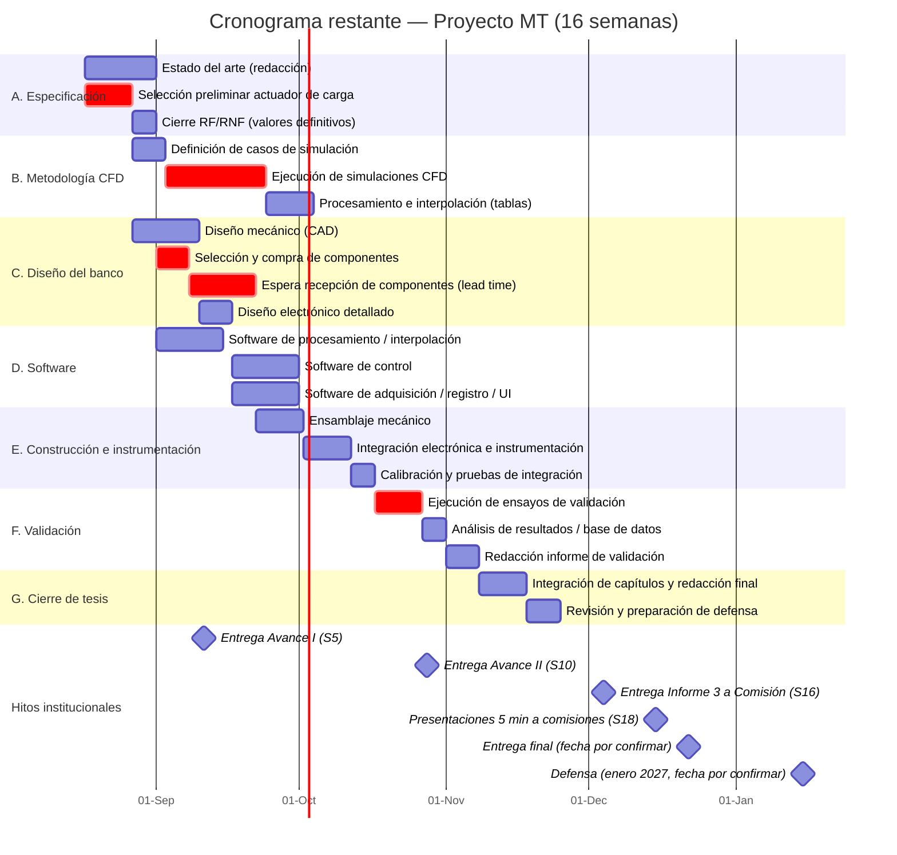

# Cronograma — Etapas restantes del proyecto

**Horizonte:** dedicación 40–45 h/semana, entre agosto de 2026 y la defensa en enero de 2027.
**Fecha de inicio asumida:** 17 de agosto de 2026.
**Hitos institucionales fijos:** Avance I (11/09/26) · Avance II (28/10/26) · Informe 3 a Comisión (04/12/26) · Presentaciones de 5 min (15/12/26) · Entrega final y Defensa (enero 2027, fechas por confirmar).

**Punto de partida:** revisión de literatura (73 referencias), borrador de RF/RNF, casos de uso y arquitectura preliminar ya completados (no se incluyen en este cronograma).

> Este cronograma **no asume decisiones de diseño ya tomadas**. Las tareas "Selección preliminar de actuador de carga" y "Estado del arte" están agendadas como próximos pasos, no como algo a resolver hoy — se incluyen aquí solo para dimensionar el tiempo total disponible.

---

## Diagrama Gantt

---

## Tabla de fases, entregables y dependencias

| Fase | Tarea | Duración | Depende de | Entregable asociado (`01_Especificacion_del_Proyecto.md`, §11) |
|---|---|---|---|---|
| A | Estado del arte | 15 d | Revisión de literatura (ya completa) | 1. Documento de especificación y requisitos |
| A | Selección preliminar de actuador de carga | 10 d | — | 1. Documento de especificación y requisitos |
| A | Cierre de RF/RNF con valores definitivos | 5 d | Selección de actuador | 1. Documento de especificación y requisitos |
| B | Definición de casos de simulación CFD | 7 d | Selección de actuador (define geometría/rango) | 2. Metodología CFD |
| B | Ejecución de simulaciones CFD | 21 d | Casos definidos | 2. Metodología CFD |
| B | Procesamiento e interpolación → tablas de carga | 10 d | Simulaciones CFD | 2. Metodología CFD |
| C | Diseño mecánico (CAD) | 14 d | Selección de actuador | 3. Diseño conceptual y detallado |
| C | Selección y compra de componentes | 7 d | RF/RNF cerrados | 3. Diseño conceptual y detallado |
| C | Espera de recepción de componentes | 14 d | Compra realizada | — (logística) |
| C | Diseño electrónico detallado | 7 d | Diseño mecánico | 3. Diseño conceptual y detallado |
| D | Software de procesamiento/interpolación | 14 d | RF/RNF cerrados | 5. Software de operación, control y DAQ |
| D | Software de control | 14 d | Diseño electrónico | 5. Software de operación, control y DAQ |
| D | Software de adquisición/registro/UI | 14 d | Diseño electrónico | 5. Software de operación, control y DAQ |
| E | Ensamblaje mecánico | 10 d | Componentes recibidos | 4. Sistema experimental construido e instrumentado |
| E | Integración electrónica e instrumentación | 10 d | Ensamblaje + software listo | 4. Sistema experimental construido e instrumentado |
| E | Calibración y pruebas de integración | 5 d | Integración completa | 4. Sistema experimental construido e instrumentado |
| F | Ejecución de ensayos de validación | 10 d | Banco calibrado + tablas de carga listas | 6. Base de datos de resultados experimentales |
| F | Análisis de resultados | 5 d | Ensayos ejecutados | 6. Base de datos de resultados experimentales |
| F | Redacción del informe de validación | 7 d | Análisis completo | 7. Informe de validación experimental |
| G | Integración de capítulos y redacción final | 10 d | Todos los entregables anteriores | Documento de tesis completo |
| G | Revisión y preparación de defensa | 7 d | Redacción final | — |

---

## Hitos institucionales y qué debería estar listo en cada uno

| Hito | Fecha | Semana (S) | Estado esperado del proyecto según este cronograma |
|---|---|---|---|
| **Avance I** | Viernes 11/09/26 | S5 | Fase A prácticamente cerrada: RF/RNF definitivos (~31/08), actuador de carga seleccionado (~26/08), simulaciones CFD ya en ejecución. Contenido natural para este avance: documento de especificación + metodología CFD en curso. |
| **Avance II** | Miércoles 28/10/26 | S10 | Diseño mecánico/electrónico y software (Fases C y D) completados (~30/09–01/10); banco ensamblado e integrado (~11/10); ensayos de validación recién terminando (~26/10). Contenido natural: banco construido e instrumentado + primeros resultados de validación. |
| **Informe 3 a Comisión** | Viernes 04/12/26 | S16 | Según la ruta crítica, la redacción final (Fase G) debería estar cerrando hacia el 24/11 — esto deja **~10 días de margen** antes de esta entrega. Es el colchón más importante del cronograma; conviene no consumirlo antes de llegar aquí. |
| **Presentaciones 5 min a comisión** | Martes 15/12/26 | S18 | Preparación de la presentación oral, usando el Informe 3 ya entregado como base. |
| **Entrega final** | Por confirmar (estimado ~22/12/26) | — | Incorporar correcciones/observaciones de la comisión tras el Informe 3 y las presentaciones. |
| **Defensa** | Enero de 2027 (por confirmar) | — | Preparación final de la defensa; el mes de por medio (dic-ene) actúa como colchón adicional frente a atrasos acumulados durante la construcción y validación. |

## Ruta crítica y riesgos del cronograma

Las tareas marcadas como críticas (`crit` en el diagrama) son las que, si se atrasan, atrasan todo el proyecto:

1. **Selección preliminar de actuador de carga (Fase A):** es la decisión que desbloquea CAD, compra de componentes y casos CFD simultáneamente. Cuanto antes se cierre, más tareas se pueden paralelizar.
2. **Ejecución de simulaciones CFD (21 días):** es una estimación optimista. La literatura del Tema 1 (p. ej. Ghoreyshi et al. 2010; Allen & Ghoreyshi 2018) usa maniobras/muestreos diseñados justamente para reducir el número de corridas necesarias — vale la pena revisar esas estrategias antes de fijar el plan de simulaciones, porque el mallado y la convergencia suelen tomar más tiempo del previsto.
3. **Compra + espera de componentes (21 días combinados):** este es, en la práctica, el riesgo más subestimado en cronogramas de banco de ensayos — corresponde directamente al **riesgo #5** ya identificado en la especificación del proyecto ("Disponibilidad limitada de recursos para fabricación"). Se recomienda iniciar la investigación de proveedores/tiempos de entrega **en paralelo** con el diseño mecánico, no después.
4. **Ejecución de ensayos de validación:** al ser la última etapa antes del cierre, cualquier atraso acumulado de las fases B–E la comprime directamente, aumentando el riesgo #6 ("Validación experimental insuficiente") ya identificado en la especificación. Con las fechas institucionales incorporadas, este cronograma llega a la redacción final hacia el **24/11**, dejando solo **~10 días de margen** frente al Informe 3 (04/12) — ese margen es, en la práctica, todo el colchón disponible para absorber atrasos en CFD o en la llegada de componentes.

## Holguras y recomendaciones de paralelización

- El software (Fase D) puede avanzar en paralelo a la espera de componentes (C2b) porque solo depende del diseño electrónico, no de tener el hardware físico en mano — conviene explotar esa holgura.
- El estado del arte (Fase A) no bloquea nada técnico; puede extenderse o comprimirse sin afectar la ruta crítica, salvo que retrase la selección del actuador.
- Si la selección de actuador se demora más de lo planeado, el impacto se propaga a **todas** las fases siguientes — es la variable individual más sensible del cronograma completo.

## Pendiente / a revisar

- Este cronograma asume que "Selección preliminar de actuador de carga" toma 10 días; si prefieres primero cerrar el estado del arte completo antes de decidir, el cronograma se corre proporcionalmente y reduce el margen disponible para la Fase F (validación).
- No incluye tiempo de revisión con el profesor guía/comité, que conviene insertar como hitos de control cada 3-4 semanas.
