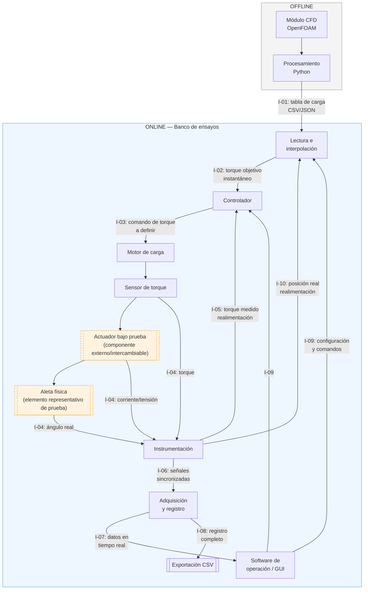

# Arquitectura del Sistema

**Proyecto:** Banco de ensayos para dimensionamiento y caracterización de actuadores de superficies de control basado en cargas CFD.

> **Actualización (revisión de arquitectura mecánica):** el banco incorpora una **aleta física representativa** montada en el mismo eje que el actuador bajo prueba, enfrentada a un **motor de carga** que aplica el torque equivalente derivado de CFD. El torque objetivo se recalcula en tiempo real a partir de la posición angular *real* de la aleta (no de un perfil temporal fijo), cerrando un lazo posición→torque. Ver notas al final de cada sección afectada.

## 1. Visión general

La arquitectura separa explícitamente dos dominios, conforme al alcance del proyecto (que excluye el *"acoplamiento directo entre CFD y el banco de ensayos"*, entendido como: no se ejecuta CFD durante el ensayo; sí se permite recalcular en tiempo real la interpolación sobre la tabla ya generada):

- **Dominio OFFLINE:** generación de cargas aerodinámicas mediante CFD y su procesamiento hasta convertirlas en tablas de carga reutilizables. No interactúa en tiempo real con el banco.
- **Dominio ONLINE:** lectura de la tabla de carga, interpolación (ahora realimentada por la posición real de la aleta), control de la aplicación de torque, instrumentación y adquisición de datos durante el ensayo físico.

El único punto de acoplamiento entre ambos dominios sigue siendo la **tabla de carga** (archivo CSV/JSON), lo que permite sustituir la fuente de datos (nueva aplicación, nueva geometría) sin modificar el banco físico ni el software de control — este es el mecanismo concreto que materializa la modularidad exigida en el alcance del proyecto (RNF-MOD-01, RNF-MOD-02).

El banco monta, en un solo eje, en serie: **motor de carga → sensor de torque → actuador bajo prueba → aleta física representativa**. La aleta no experimenta carga aerodinámica real (no hay túnel de viento); su rol es ser el elemento cuyo ángulo real se mide, y cuya inercia/holgura mecánica forman parte de lo que se caracteriza.

```mermaid
flowchart LR
    subgraph OFFLINE["Dominio OFFLINE (fuera de línea)"]
        direction TB
        A[Simulación CFD<br/>OpenFOAM] --> B[Generación de<br/>tablas aerodinámicas]
        B --> C[Procesamiento /<br/>reducción de datos]
    end

    C -->|Archivo CSV / JSON<br/>tabla de carga| D

    subgraph ONLINE["Dominio ONLINE (banco de ensayos)"]
        direction TB
        D[Lectura de<br/>tabla de carga] --> E[Interpolación<br/>realimentada por posición]
        E --> F[Torque objetivo<br/>de referencia]
        F --> G[Controlador]
        G --> H[Motor de carga]
        H --> S[Sensor de torque]
        S --> ACT[Actuador bajo prueba]
        ACT --> AL[Aleta física]
        AL -->|Encoder: ángulo real| ENC[Instrumentación]
        S -->|Torque medido| ENC
        ENC -->|Realimentación de torque| G
        ENC -->|Realimentación de posición| E
        ENC --> I[Adquisición<br/>de datos]
        I --> J[Resultados /<br/>exportación]
    end

    style OFFLINE fill:#f4f4f4,stroke:#999
    style ONLINE fill:#eef6ff,stroke:#5b9bd5
```

## 2. Subsistemas

### 2.1 Módulo CFD (offline)

**Responsabilidad:** obtener las cargas fluidodinámicas sobre la superficie de control mediante simulaciones CFD y estructurarlas en una tabla aerodinámica.

- **Entradas:** geometría de la superficie de control, condiciones de operación (Mach, ángulo de ataque, deflexión).
- **Salidas:** tabla aerodinámica cruda (coeficientes/torque de charnela en función de las variables de entrada).
- **Fuera de alcance del banco:** este módulo se ejecuta de forma independiente y no forma parte del software entregable del proyecto; su salida es la única interfaz con el resto del sistema.
- **RF relacionados:** ninguno directo (es la fuente externa que consume RF-CFD-01).

### 2.2 Módulo de procesamiento (Python, offline)

**Responsabilidad:** transformar la salida cruda de CFD en una tabla de carga lista para ser consumida por el banco (limpieza, formato, eventualmente reducción de orden o ajuste de superficie de respuesta).

- **Entradas:** salida del Módulo CFD.
- **Salidas:** archivo de tabla de carga (CSV/JSON) con estructura validada.
- **RF relacionados:** RF-CFD-01, RF-CFD-02.

### 2.3 Lectura e interpolación (online)

**Responsabilidad:** importar la tabla de carga, validar su estructura y rango, e interpolar el torque objetivo. A diferencia de la versión anterior de esta arquitectura, el torque objetivo **no se limita a un perfil temporal precalculado**: la tabla de carga relaciona torque con (Mach, ángulo de ataque, **deflexión de la aleta**), por lo que este módulo recibe continuamente la **posición angular real de la aleta** (medida por el encoder) y recalcula el torque objetivo correspondiente a esa posición, no a la posición comandada. El perfil temporal generado al configurar el ensayo (CU-002) sigue existiendo como **referencia inicial y como envolvente de validación**, pero el valor aplicado en cada instante proviene del recálculo en tiempo real.

- **Entradas:** tabla de carga (archivo), parámetros del ensayo definidos por el operador (escenario/maniobra), posición angular real de la aleta (realimentación, I-10).
- **Salidas:** torque objetivo instantáneo, perfil temporal de referencia (para comparación/validación), estimación del error de interpolación.
- **RF relacionados:** RF-CFD-01 a RF-CFD-04, RF-PRO-01 a RF-PRO-06.

### 2.4 Controlador

**Responsabilidad:** ejecutar el lazo de control que compara el torque objetivo (recalculado según posición real, 2.3) con el torque medido y comanda el motor de carga, incluyendo la **compensación activa del torque parásito** inducido por el movimiento del actuador bajo prueba (efecto documentado en la literatura del Tema 2: Yao et al. 2010/2012; Lee & Cho 2001), típicamente mediante feedforward o sincronización de velocidad. El controlador también implementa la **protección ante atasco mutuo (stall)**: si el actuador bajo prueba y el motor de carga se oponen de forma sostenida sin que la posición de la aleta cambie, el sistema debe detectar la condición y llevar el banco a estado seguro, en lugar de forzar ambos motores indefinidamente.

- **Entradas:** torque objetivo instantáneo (de 2.3), torque medido (de 2.5), posición angular real de la aleta (de 2.5), límites de seguridad configurados.
- **Salidas:** comando al motor de carga; señales de parada ante condición de falla o de atasco mutuo.
- **RF relacionados:** RF-BAN-01 a RF-BAN-04, RF-BAN-06, RF-SWC-02.
- **RNF relacionados:** RNF-REN-01, RNF-REN-02, RNF-REN-03, RNF-SEG-02, RNF-SEG-04.

### 2.5 Banco: motor de carga + sensor de torque + actuador bajo prueba + aleta + instrumentación

**Responsabilidad:** aplicar físicamente el torque comandado sobre el eje (motor de carga), medir el torque real transmitido (sensor de torque) y medir la posición angular real alcanzada por la **aleta** (no por el actuador internamente, dado que puede haber holgura o compliance entre ambos bajo carga).

- **Entradas:** comando de torque del Controlador.
- **Salidas:** torque medido y posición angular de la aleta hacia el Controlador y hacia Lectura e interpolación (realimentación), y hacia Adquisición de datos.
- **Interfaz externa:** el **actuador bajo prueba** es un componente intercambiable, fuera del alcance de desarrollo del proyecto (ver "No incluye" en `01_Especificacion_del_Proyecto.md`), montado mediante un acople mecánico normalizado.
- **Aleta física:** elemento de prueba representativo (no vinculado a una plataforma o geometría específica), montado rígidamente en el mismo eje; no está sometida a carga aerodinámica real — su función es ser el punto de medición del ángulo real y aportar la inercia/dinámica que el actuador debe vencer bajo carga.
- **RF relacionados:** RF-BAN-01, RF-BAN-05 (aplicación física del torque comandado y modo manual — la decisión de control, incluida la detección de atasco mutuo RF-BAN-06, se aloja en el Controlador, sección 2.4), RF-INS-01 a RF-INS-04, RF-SIS-02.
- **RNF relacionados:** RNF-PRE-02, RNF-PRE-03, RNF-PRE-04, RNF-SEG-01, RNF-SEG-03, RNF-SEG-04.

### 2.6 Adquisición de datos y registro

**Responsabilidad:** sincronizar temporalmente las señales medidas, registrarlas junto con la referencia objetivo, y dejarlas disponibles para visualización y exportación.

- **Entradas:** señales medidas de 2.5, referencia objetivo de 2.3.
- **Salidas:** registro de ensayo (variables + eventos + configuración), archivo exportable (CSV).
- **RF relacionados:** RF-INS-04, RF-INS-05, RF-SWC-04, RF-SWC-05.
- **RNF relacionados:** RNF-DOC-01.

### 2.7 Software de operación (interfaz de usuario)

**Responsabilidad:** proveer al operador la interfaz para importar tablas, configurar ensayos, ejecutarlos/detenerlos, visualizar variables en tiempo real y consultar la bitácora.

- **RF relacionados:** RF-SWC-01, RF-SWC-03, RF-SWC-06.
- **RNF relacionados:** RNF-USA-01, RNF-USA-02.

## 3. Interfaces entre subsistemas

| ID   | Origen                             | Destino                           | Datos intercambiados                                      | Formato / mecanismo                                                                                 | RF relacionado                  |
| ---- | ----------------------------------- | ---------------------------------- | ----------------------------------------------------------- | ------------------------------------------------------------------------------------------------------ | ---------------------------------- |
| I-01 | Módulo de procesamiento (offline)  | Lectura e interpolación (online)  | Tabla de carga aerodinámica                                | Archivo CSV/JSON                                                                                      | RF-CFD-01, RF-CFD-02             |
| I-02 | Lectura e interpolación            | Controlador                        | Torque objetivo instantáneo (recalculado por posición)     | Estructura interna / cola de referencias                                                              | RF-PRO-05, RF-PRO-06             |
| I-03 | Controlador                        | Motor de carga                     | Comando de torque                                          | **Por definir** — candidatos: bus de tiempo real (EtherCAT/CAN) o señal analógica + driver           | RF-BAN-01                        |
| I-04 | Motor de carga / actuador bajo prueba / aleta | Instrumentación         | Señales físicas (torque, posición angular de la aleta, corriente/tensión) | Señal analógica o digital de sensor                                                                   | RF-INS-01, RF-INS-02, RF-INS-03  |
| I-05 | Instrumentación                    | Controlador                        | Torque medido (realimentación del lazo de control)         | Señal digitalizada, ciclo de control                                                                  | RF-BAN-02, RF-SWC-02             |
| I-06 | Instrumentación                    | Adquisición de datos              | Señales digitalizadas y sincronizadas                      | Bus/DAQ interno                                                                                       | RF-INS-04                        |
| I-07 | Adquisición de datos               | Software de operación             | Datos en tiempo real para visualización                    | Interna (misma aplicación o IPC)                                                                      | RF-SWC-03                        |
| I-08 | Adquisición de datos               | Almacenamiento / exportación      | Registro completo del ensayo                                | Archivo CSV                                                                                            | RF-SWC-04, RNF-DOC-01            |
| I-09 | Software de operación              | Operador                           | Configuración, visualización, control del ensayo           | Interfaz gráfica (GUI)                                                                                | RF-SWC-01, RF-SWC-06             |
| **I-10** | **Instrumentación**            | **Lectura e interpolación**       | **Posición angular real de la aleta (realimentación)**     | **Señal digitalizada, ciclo de interpolación**                                                        | **RF-PRO-06**                    |

> **Nota:** I-10 es la interfaz nueva que cierra el lazo posición→torque descrito en 2.3. Antes de esta revisión, la interpolación solo generaba un perfil temporal fijo (I-02 unidireccional); ahora I-02 transporta un torque objetivo que cambia en cada ciclo según la posición real reportada por I-10.
>
> La interfaz I-03 (comando de torque hacia el motor de carga) es la única que depende directamente de decisiones de diseño mecánico/electrónico aún no tomadas (tipo de motor de carga — ver Tema 2 y 3 de la revisión de literatura). Debe cerrarse en la etapa de diseño detallado (OE-3) y actualizarse en esta tabla.

## 4. Diagrama de bloques detallado

*Los nodos "Actuador bajo prueba" y "Aleta física" se resaltan con borde punteado para indicar que son elementos externos/representativos (RF-SIS-02), no desarrollados dentro del alcance del proyecto.*

## 5. Supuestos de diseño

1. **Desacople offline/online estricto:** la única interfaz entre CFD y banco es el archivo de tabla de carga (I-01); no existe retroalimentación desde el banco hacia el módulo CFD ni ejecución de CFD durante el ensayo, conforme al alcance del proyecto. Sí existe retroalimentación *interna* al dominio online (I-10) entre instrumentación e interpolación — esto no constituye acoplamiento directo con CFD.
2. **Actuador bajo prueba como componente externo:** el banco se diseña para admitir distintos actuadores mediante un acople mecánico normalizado (RF-SIS-02); su desarrollo interno queda fuera de alcance.
3. **Aleta como elemento representativo de prueba:** no está vinculada a una geometría o plataforma específica y no experimenta carga aerodinámica real; su rol es servir de punto de medición de ángulo real y de fuente de inercia/dinámica adicional. No contradice la exclusión de "diseño del misil o torpedo" del alcance del proyecto.
4. **Protocolo de comunicación controlador–banco (I-03) pendiente de definición:** se evaluará en la etapa de diseño detallado en función de los requisitos de frecuencia del lazo de control (RNF-REN-01) y de las alternativas identificadas en la literatura (Tema 6: EtherCAT — Zhang et al. 2024; Bahari et al. 2025).
5. **Arquitectura de software modular:** "Lectura e interpolación", "Controlador", "Instrumentación/DAQ" y "Software de operación" se conciben como módulos con interfaces internas bien definidas, pudiendo implementarse como procesos separados o como una única aplicación multihilo, según se decida en el diseño detallado (RNF-MAN-01).
6. **Un solo banco, un solo actuador a la vez:** no se contempla operación simultánea de múltiples bancos ni de múltiples actuadores en paralelo en la versión actual del alcance.
7. **Trazabilidad de ensayos:** cada ejecución del ciclo I-01 → I-08 debe quedar asociada a la tabla de carga y configuración utilizadas (RNF-DOC-01), de modo que un resultado experimental sea siempre reproducible.
8. **Alineación mecánica y margen dinámico del conjunto en un solo eje:** el montaje en serie (motor de carga–sensor–actuador–aleta) exige alta concentricidad para que el sensor de torque no registre cargas parásitas radiales o de flexión; adicionalmente, la frecuencia natural del conjunto (incluyendo la inercia de la aleta) debe quedar suficientemente alejada del ancho de banda del lazo de control para evitar acoplamiento dinámico no deseado (ver RNF-PRE-04 y RNF-REN-03).

## 6. Trazabilidad arquitectura → requisitos (resumen)

| Subsistema                          | RF                                                    | RNF                                                          |
| ------------------------------------ | ------------------------------------------------------ | --------------------------------------------------------------- |
| Módulo de procesamiento (offline)   | RF-CFD-01, RF-CFD-02                                  | —                                                               |
| Lectura e interpolación             | RF-CFD-03, RF-CFD-04, RF-PRO-01 a RF-PRO-06           | —                                                               |
| Controlador                         | RF-BAN-01 a RF-BAN-04, RF-BAN-06, RF-SWC-02           | RNF-REN-01, RNF-REN-02, RNF-REN-03, RNF-SEG-02, RNF-SEG-04     |
| Banco (motor de carga + actuador + aleta) + instrumentación | RF-BAN-05, RF-INS-01 a RF-INS-04, RF-SIS-02 | RNF-PRE-02, RNF-PRE-03, RNF-PRE-04, RNF-SEG-01, RNF-SEG-03     |
| Adquisición y registro              | RF-INS-05, RF-SWC-04, RF-SWC-05                       | RNF-DOC-01                                                      |
| Software de operación               | RF-SWC-01, RF-SWC-03, RF-SWC-06                       | RNF-USA-01, RNF-USA-02                                          |
| Arquitectura general                | RF-SIS-01                                             | RNF-MOD-01, RNF-MOD-02, RNF-MAN-01, RNF-MAN-02                 |

## 7. Pendiente / a definir en próxima iteración

- Selección del tipo de motor de carga (eléctrico rotativo vs. hidráulico rotativo) — condiciona directamente la interfaz I-03 y el diseño del Controlador. Ver Tema 2 y 3 de la revisión de literatura para alternativas.
- Selección del bus/protocolo de comunicación entre Controlador e Instrumentación (I-03, I-04, I-05, I-06, I-10).
- **Estrategia concreta de compensación del torque parásito** (feedforward de velocidad, sincronización de velocidad, control robusto — ver Tema 2: Yao et al. 2010/2012; Lee & Cho 2001; Nam 2001) a seleccionar antes del diseño detallado del Controlador.
- **Criterio de detección de atasco mutuo (stall)** entre motor de carga y actuador bajo prueba (umbral de torque diferencial sostenido, timeout) — a definir junto con RNF-SEG-04.
- Definir si "Lectura e interpolación", "Controlador" y "Software de operación" se implementan como una única aplicación o como procesos/servicios separados.
