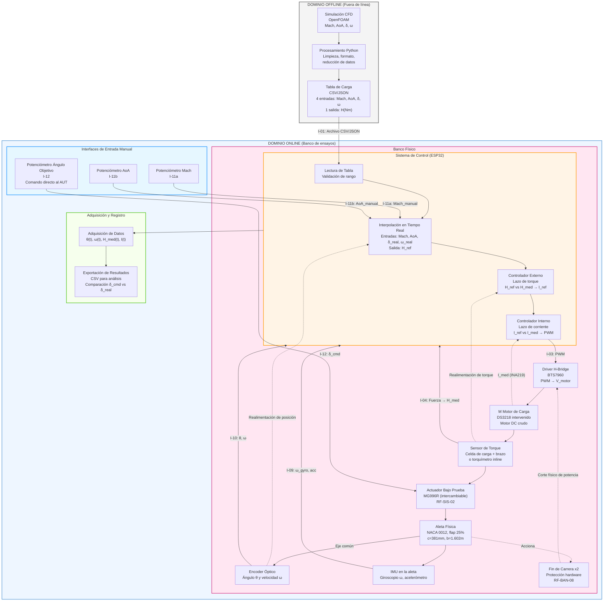
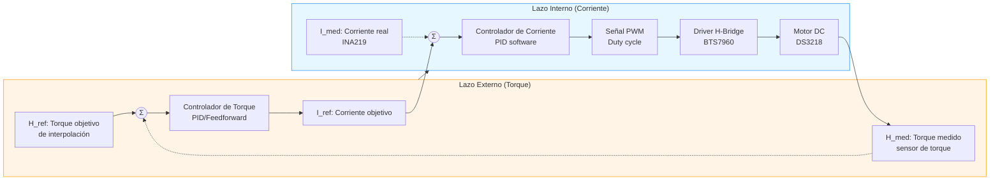
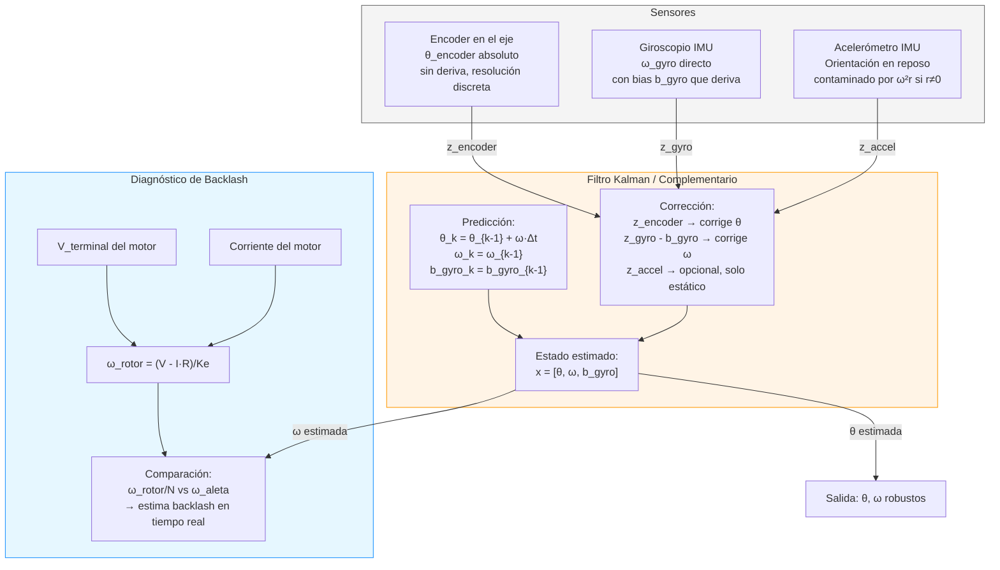
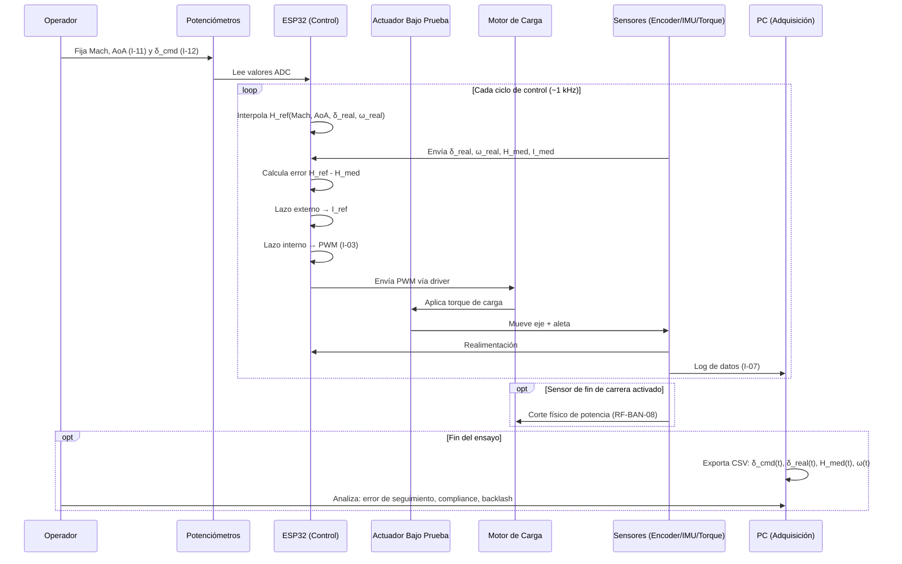

# Diagrama de Arquitectura del Sistema — Banco de Ensayos de Actuadores

**Referencia:** Estilo анастасοpoulos & Hornung (2018) — bancos de carga dinámica para caracterización de actuadores de superficies de control.

---

## Diagrama principal de arquitectura (Mermaid)

---

## Leyenda de interfaces (I-01 a I-12)

| ID             | Tipo               | Descripción                                                   | Dirección                    | Estado                  |
| -------------- | ------------------ | -------------------------------------------------------------- | ----------------------------- | ----------------------- |
| **I-01** | Archivo            | Tabla de carga CFD (CSV/JSON)                                  | Offline → Online             | ✅ Implementada         |
| **I-02** | Eléctrica         | Alimentación 12V/5V al banco                                  | Fuente → Banco               | ✅ Implementada         |
| **I-03** | PWM                | Comando de torque al motor de carga (duty cycle)               | ESP32 → Driver BTS7960       | ✅ Implementada         |
| **I-04** | Analógica/Digital | Medición de fuerza (celda de carga) → torque calculado       | Celda → ESP32 (HX711)        | ⚠️ En reevaluación   |
| **I-05** | Digital            | Lectura de encoder (posición θ)                              | Encoder → ESP32              | ✅ Implementada         |
| **I-06** | UART/I2C           | Lectura de IMU (giroscopio ω, acelerómetro)                  | IMU → ESP32                  | ✅ Implementada         |
| **I-07** | UART/USB           | Comunicación con PC (envío de datos)                         | ESP32 → PC                   | ✅ Implementada         |
| **I-08** | Digital            | Comando de posición al actuador bajo prueba                   | ESP32 → MG996R               | ✅ Implementada         |
| **I-09** | I2C/SPI            | Lectura fusionada encoder+IMU para estimación de estado       | Sensor Fusion → Control      | ✅ En desarrollo (§10) |
| **I-10** | Realimentación    | Posición angular real δ_real y velocidad ω_real de la aleta | Encoder/IMU → Interpolación | ✅ Implementada         |
| **I-11** | Analógica         | Potenciómetros de condiciones de vuelo (Mach, AoA)            | Pot → ADC ESP32              | ✅ Implementada         |
| **I-12** | Analógica         | Potenciómetro de ángulo objetivo (comando manual directo)    | Pot → ADC ESP32 → AUT       | ✅ Implementada         |

---

## Diagrama de lazo de control (detalle)

**Nota:** Ambos lazos están cerrados **en software** dentro del mismo ESP32, no en hardware dedicado. Esto es una decisión de arquitectura para mantener la simplicidad del driver (BTS7960 sin electrónica de control propia) y la flexibilidad del algoritmo de control.

---

## Diagrama de fusión sensorial (ángulo y velocidad)

**Referencia completa:** Ver sección 10 de `10_Estrategia_Estimacion_Torque_Fusion_Sensorial.md` para la formulación matemática detallada y la secuencia de implementación incremental.

---

## Flujo de datos durante un ensayo típico

---

## Comparación con Anastasopoulos & Hornung (2018)

| Característica                               | Anastasopoulos & Hornung (2018)          | Este proyecto                                                                       |
| --------------------------------------------- | ---------------------------------------- | ----------------------------------------------------------------------------------- |
| **Tecnología de aplicación de carga** | Motor brushless con driver COTS          | Motor DC (DS3218 intervenido) con driver BTS7960                                    |
| **Lazo de control**                     | Torque vía corriente, hardware dedicado | Torque vía corriente,**software en ESP32**                                   |
| **Sensor de torque**                    | Torquímetro rotativo inline             | Celda de carga + brazo (⚠️ en reevaluación) o torquímetro                       |
| **Medición de posición**              | Encoder en el eje                        | Encoder + IMU (fusión sensorial, §10)                                             |
| **Protección de límites**             | Topes físicos + software                | **Fin de carrera hardware independiente** (RF-BAN-08) + software              |
| **Interfaz manual**                     | No reportada                             | **Panel de potenciómetros** (I-11: condiciones vuelo, I-12: comando directo) |
| **Back-EMF como diagnóstico**          | No reportado                             | **Sí**: ω_rotor/N vs ω_aleta → estima backlash en tiempo real             |
| **Modularidad**                         | Banco fijo para un tipo de actuador      | **Actuador bajo prueba intercambiable** (RF-SIS-02)                           |

---

**Documento relacionado:** `05_Arquitectura_del_Sistema.md` para la descripción textual completa de subsistemas y requisitos trazables.
